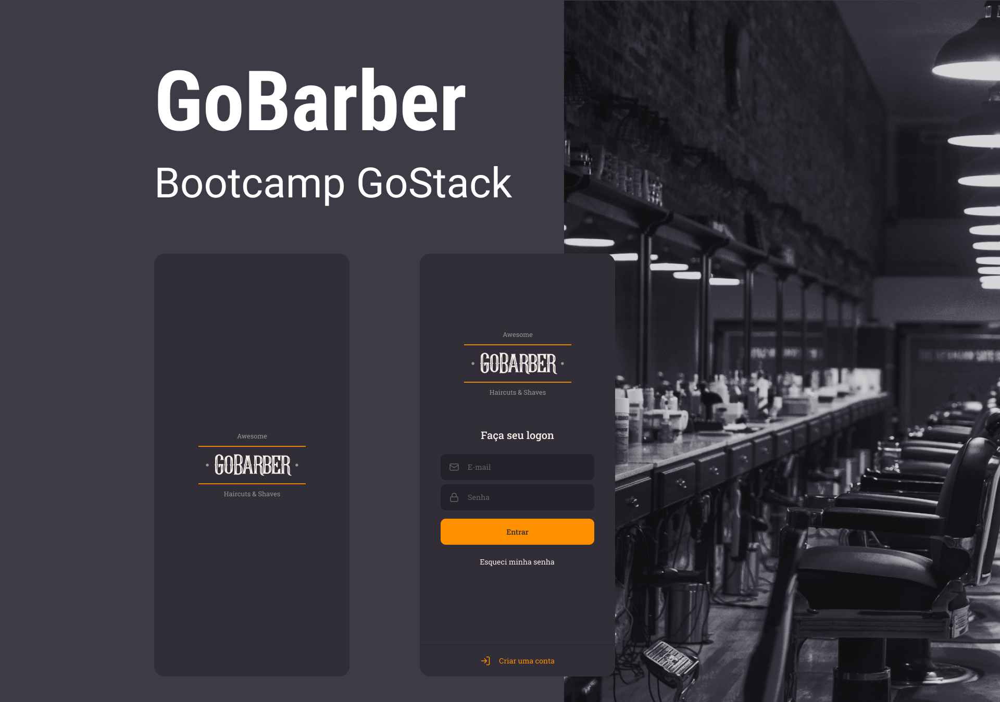

<div align="center">
  
</div>

</br>

<div align="center">
  <p align="center" >
    <a href="#-sobre"> Sobre </a> |
    <a href="#-prévia"> Prévia </a> |
    <a href="#-tecnologias"> Tecnologias </a> |
    <a href="#-iniciar"> Iniciar </a> |
    <a href="#-licença"> Licença </a>
  </p>

</div>

## 📚 Sobre

Projeto desenvolvido durante o bootcamp GoStack 11 da [Rocketseat](https://github.com/Rocketseat).

O projeto Mobile foi desenvolvido com [React Native](https://reactnative.dev/) e tem por objetivo criar um aplicativo para agendar atendimentos com o prestador selecionado, filtrando as datas e horários disponíveis.

Para acessar a api, [clique aqui](https://github.com/thudf/gobarber-api). </br>

Para acessar a aplicação web, [clique aqui](https://github.com/thudf/gobarber-web). </br>

## 💡 Prévia

<div align="center">
  

  
</div>

<div align="center">
  

  
</div>

## 🚀 Tecnologias

As princiais tecnologias utilizadas no projeto Mobile:

- [TypeScript](https://www.typescriptlang.org/)
- [React Native](https://reactnative.dev/)
- [React Navigation](https://reactnavigation.org/)
- [React Native Vector Icons](https://github.com/oblador/react-native-vector-icons)
- [UnForm](https://unform.dev/)
- [Yup](https://github.com/jquense/yup)
- [Styled Components](https://styled-components.com/)
- [Axios](https://github.com/axios/axios)
- [Husky](https://github.com/typicode/husky)
- [Eslint](https://eslint.org/)
- [Prettier](https://prettier.io/)
- [EditorConfig](https://editorconfig.org/)

## 💻 Iniciar

Antes de inicar a aplicação, verifique se a [API](https://github.com/thudf/gobarber-api) está rodando

**Clone o projeto e acesse a pasta**

```bash
$ git clone https://github.com/thudf/gobarber-app.git && cd gobarber-app
```

**Siga os passos abaixo**

```bash
# Instale as dependências
$ yarn

# Verifique se a URL definida no arquivo 'src/services/api.ts' está de acordo com a URL da API que está rodando

# Se for rodar no emulador Android, inicie o emulador primeiro
# Com o emulador rodando, inicie a aplicação
$ yarn android

# Caso esteja no Linux, além de iniciar o emulador primeiro,
# Inicie o Metro Bundler antes de rodar a aplicação
$ yarn start
# Depois que o Bundler iniciar, inicie a aplicação
$ yarn android

# Caso vá rodar no emulador IOS, acesse a pasta ios:
$ cd ios
$ pod install

#retorne a pasta raiz e inicie o projeto:
$ cd ..
$ yarn start
```

## 🖊 Licença

Este projeto é desenvolvido sob a licença MIT. Veja o arquivo [LICENSE](LICENSE) para saber mais detalhes.

---

<div align="center">
  
  <p>por <strong> Arthur D'Afonseca e Silva</strong> </p>
</div>
